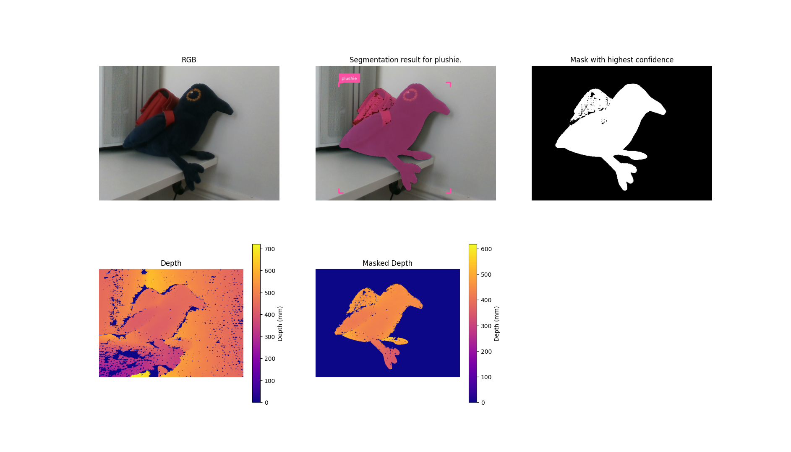

# RGB-D based point cloud generation with object recognition
This code generates a pointcloud from RGB and depth images and a name of the object to be rendered in 3D.

A mask of the object is created from the RGB image using [lang-segment-anything](https://github.com/luca-medeiros/lang-segment-anything) and applied to the depth. A pointcloud is then created from the masked depth and RGB images using open3D.

## Installation

```bash
# 1. Clone this repo
git clone git@github.com:LouiseMsn/RGB-D-2-pointcloud.git
cd RGB-D-2-pointcloud

# 2. Clone the dependencies
mkdir third-party && cd third-party
git clone git@github.com:luca-medeiros/lang-segment-anything.git
cd ..

# 3. Create the conda environment
conda env create -f environment.yml 
conda activate rgbd-pointcloud
```

## Usage
>[!NOTE]
>This code has only been tested with a Realsense D345 but should work with minimal modifications with other types of realsense cameras.

Make sure your camera is plugged in and launch :
```bash
python pose-estimation.py
```
##### Options:  
`-d` : debuging info  
`--show_pcd` :  will open the point cloud in the visualizer

## Results
If the -d option is passed during launch the following images are shown:


RGB and Depth are the entry images and the prompt is "plushie". The program then outputs the following pointcloud :

  

<sub>Visualization of the pointcloud generated with [open3d-gif-visualization](https://github.com/phillipinseoul/open3d-gif-visualization)
</sub>
 